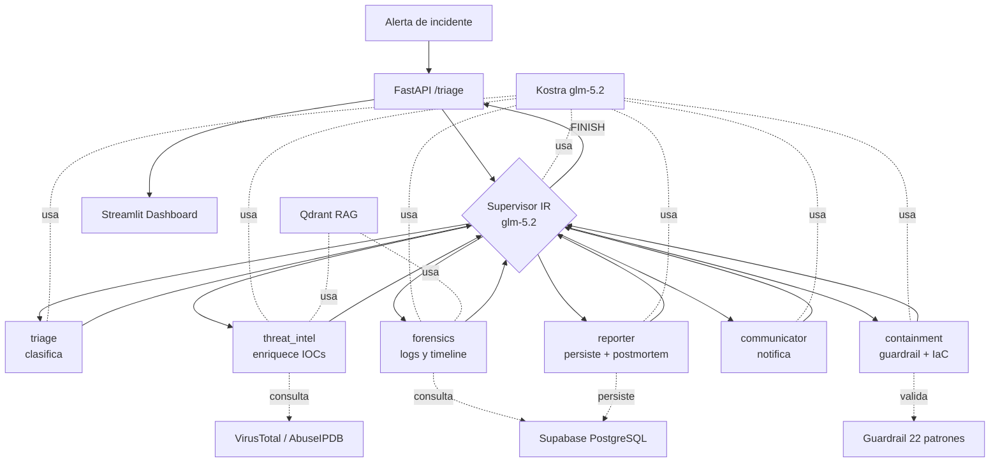

# Sistema de Triage Autónomo & Defensa Activa
### Arquitectura Supervisor-Worker Multi-Agente para el Hackathon Huawei Cloud MaaS

---

## Arquitectura



## Stack

| Capa | Tecnología |
|---|---|
| LLM | Kostra glm-5.2 (OpenAI compatible) |
| Orquestación | LangGraph supervisor-worker (6 workers) |
| Backend | FastAPI + SSE streaming |
| DB | Supabase (PostgreSQL) con RLS |
| Vector Store | Qdrant (RAG runbooks/post-mortems) |
| UI | Streamlit (streaming nodo-por-nodo) |
| Seguridad | Guardrail (22 patrones), rate limiting, CORS |
| Logging | structlog (JSON) |

## Workers

| Worker | Función | Tools |
|---|---|---|
| **triage** | Clasificar severidad, componente, security event | validate_incident, calculate_risk |
| **threat_intel** | Enriquecer IOCs con VirusTotal/AbuseIPDB | query_virustotal, query_abuseipdb, rag_query |
| **forensics** | Investigar causa raíz con logs y históricos | check_health, query_historical, search_kb, rag_query |
| **containment** | Proponer mitigación + validar con guardrail | validate_commands, sanitize_commands, generate_terraform |
| **communicator** | Redactar updates para stakeholders | (reasoning only) |
| **reporter** | Generar post-mortem + persistir a Supabase | save_incident, save_audit |

## Arranque

```powershell
cd backend
python -m pip install -r requirements.txt
python -m pytest tests/ -v          # 27 tests
python main.py                       # API en :8000
python -m streamlit run src/ui/app.py  # UI en :8501
```

## Endpoints

| Método | Path | Descripción |
|---|---|---|
| GET | /health | Healthcheck |
| POST | /triage | Ejecutar triage completo |
| POST | /stream | SSE streaming nodo-por-nodo |
| POST | /copilot/chat | Chat con LLM |
| POST | /copilot/stream | Streaming chat |

## Configuración

1. Supabase: ejecutar `supabase/schema.sql` en SQL Editor + `NOTIFY pgrst, 'reload schema'`
2. `.env`: configurar `PANGU_API_KEY` (Kostra), `SUPABASE_URL`, `SUPABASE_KEY`, `VIRUSTOTAL_API_KEY`
3. Tests: `python -m pytest tests/ -v` (27/27 pasan)
